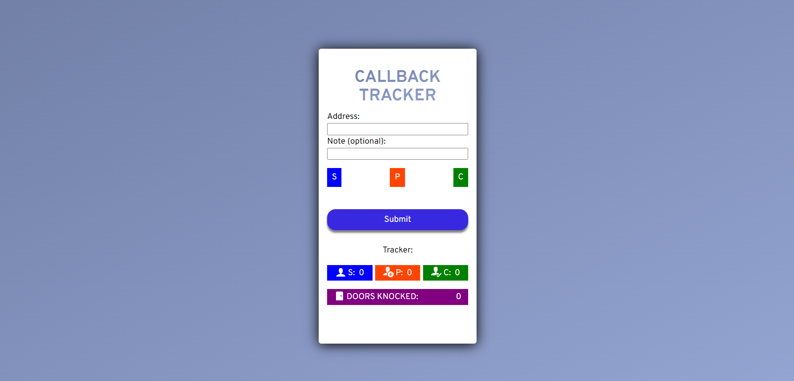

# 📝 Callback Tracker

> A digital system I created for Brand Ambassadors at Great Ormond Street Children’s Hospital to replace inefficient paper tracking.

While working as a Brand Ambassador for Great Ormond Street Children's Hospital, I noticed our outreach and donation logs were recorded on paper forms that were often lost, and this slowed down the team. To fix this, I built an online tracking tool that let ambassadors log progress remotely, reduced paper waste, and improved productivity.

The prototype wasn’t perfect, but it worked—and it sparked interest across the team, showing how small tech solutions can make everyday workflows smoother and more efficient.



---

## 👀 Why This Project Stands Out

- Eco-friendly solution reducing paper waste  
- Improves team productivity by enabling remote tracking  
- Tracks spoken interactions, presentations, and closed doors  
- Demonstrates initiative by identifying inefficiencies and creating a practical solution  
- Prototype showcases real-world problem-solving with web technologies  

---

## 🛠️ Tech Stack

- **HTML5** – Semantic structure for accessibility  
- **CSS3** – Custom styles and responsive design  
- **JavaScript (Vanilla)** – Interactive form handling and DOM manipulation  
- **SVG Icons** – Visual representation of tracker counts  

---

## ✨ Features

- Log addresses, notes, and outreach type (Spoken / Presentation / Close)  
- Automatically updates counters for spoken, presentation, and closed interactions  
- Interactive UI with color-coded buttons for quick tracking  
- Overlay notification when a milestone of 150 doors is reached  
- Editable entries and option to remove items  

---

## 🧠 What I Learned

- Translating **real-world workflow problems** into a web application  
- Handling **form validation and dynamic DOM updates**  
- Using **SVG icons** for interactive visual feedback  
- Designing **user-friendly interfaces** for non-technical users  
- Building a **prototype that demonstrates impact**  

> 📌 This project started as a personal initiative while working as a Brand Ambassador. It was inspired by recurring inefficiencies with paper tracking and demonstrates how small tech solutions can solve everyday problems.

---

## ⚙️ How to Run Locally

1. Clone the repository  
   ```bash
   git clone https://github.com/FrontEndHighRoller/callback-tracker.git
2. Open index.html in your browser
3. Resize the screen to see responsive layouts and image switching in action 🎯

---

🏆 Challenge Credit
Challenge by Frontend Mentor
https://www.frontendmentor.io

---

🙋‍♂️ Author
Dennis Rumanek

GitHub: https://github.com/FrontEndHighRoller

LinkedIn: https://www.linkedin.com/in/dennis-rumanek/

⭐ If you like this solution, feel free to star the repository!
